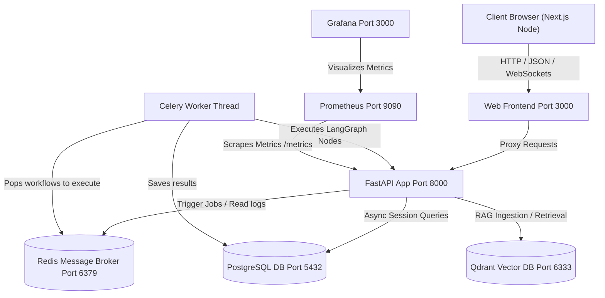
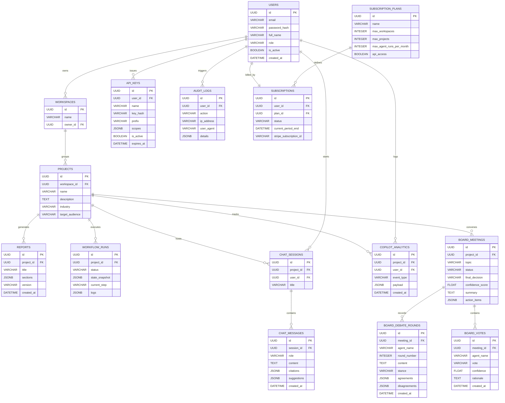
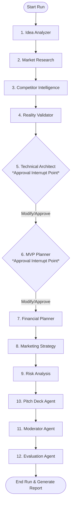

# AI Startup Co-Founder SaaS Platform Documentation

Welcome to the **AI Startup Co-Founder** technical documentation. This document provides a complete technical walkthrough of the platform's features, system architecture, database models, multi-agent workflow, RAG pipeline, and telemetry dashboards. You can use this guide to explain the entire system's functionality to other developers, designers, or business stakeholders.

---

## 1. High-Level Concept & Core Features

The **AI Startup Co-Founder** is an enterprise-grade, multi-agent validation engine that helps startup founders analyze and stress-test concepts. Instead of spending weeks on market research, architecture design, and financial modeling, users submit their idea to a cohort of **12 specialized AI Agents** structured within a LangGraph pipeline.

### Core Product Capabilities
*   **Multi-Agent Validation**: Orchestrated execution of 12 distinct AI agent nodes to generate pitch decks, financial models, architecture diagrams, market trends, GTM frameworks, threat vectors, and viability scores.
*   **Reality Validator (Startup Killer)**: A brutally honest skeptic-investor node that stress-tests critical assumptions, estimates customer acquisition costs (CAC) in local currency (INR/USD), calculates failure probabilities, and outlines recommended pivots.
*   **AI Founder Copilot (Interactive Workspace)**: A RAG-enriched chat assistant allowing users to query startup databases, view semantic search citations, and receive real-time follow-up suggestions in a dedicated sub-workspace.
*   **AI Board of Directors (Resolution boardroom)**: A courtroom workspace where 11 virtual advisors (CEO, CTO, CFO, CPO, COO, CRO, etc.) debate and vote on strategic startup resolutions, computing a weighted consensus score and adjourning meetings with actionable next steps.
*   **Human-In-The-Loop (HITL) Checkpoints**: Deliberate execution pauses before key architecture and roadmap steps, allowing founders to approve draft data, correct directions, and inject custom directives.
*   **RAG vector-search Pipeline**: Real-time context retrieval via Qdrant to enrich prompt templates with actual business frameworks, market reports, and reference designs.
*   **Telemetric Streaming Logs**: Real-time websocket logging that streams terminal updates of active agent nodes to the UI.
*   **Tiered Subscription & API Keys**: Free, Pro, and Enterprise subscription tiers with distinct usage bounds and scoping tools for generating programmatic API keys.

---

## 2. System Architecture

The project is structured as a decoupled containerized architecture deployed using Docker Compose:



### Infrastructure Layer Details
1.  **FastAPI Backend**: Manages user authentication, project creation, API key scopes, and handles polling/WebSockets/SSE metrics.
2.  **Next.js Frontend**: Responsive, modern tailwind-based dashboard that supports live run logs, interactive checkpoint approvals, copilot chat, boardroom debates, and PDF reports.
3.  **Celery Worker**: Processes heavy LangGraph workflows asynchronously so API requests are not blocked. Concurrency is limited to 1 in free-tier nodes with worker child recycling to keep memory usage under 250MB.
4.  **Redis Cache/Broker**: Coordinates celery task cues and implements a Pub/Sub telemetry channel to stream log alerts and boardroom statements to clients.
5.  **PostgreSQL**: Stores relational database models including workspace objects, projects, generated investor reports, chat history, boardroom records, and credentials.
6.  **Qdrant Vector Store**: Handles high-performance semantic search over ingested frameworks and competitor matrices.
7.  **Prometheus & Grafana**: Monitors system telemetry, API latency distribution, request counters, and memory leak warnings.

---

## 3. Database Schema

The database uses SQLAlchemy mapped columns to shape relational entities:



---

## 4. LangGraph Multi-Agent Workflow

The central execution pipeline is structured as a `StateGraph` in `backend/app/agents/graph.py`. It coordinates 12 agents in a sequential workflow, featuring Human-In-The-Loop (HITL) checkpoints.



### Agent-by-Agent Functionality

| # | Agent Name | Primary Responsibility | Key Inputs | Key Output Attributes |
|---|---|---|---|---|
| **1** | **Idea Analyzer** | Evaluates core concept and identifies base category. | Idea, Industry, Target Audience | `category`, `target_users`, `business_model`, `key_assumptions` |
| **2** | **Market Research** | Estimates global market sizing metrics bottom-up. | Idea Category, Target Users | `market_demand`, `tam`, `sam`, `som`, `trends` |
| **3** | **Competitor Intel** | Identifies competing platforms and market pricing structures. | Category, Competitor context | `competitors` (name, pricing, positioning), `opportunities` |
| **4** | **Reality Validator** | Stress-tests assumptions as a skeptic investor. | Category, Competitor context, TAM | `viability_score`, `viability_grade`, `failure_probability`, `critical_assumptions`, `pivots` |
| **5** | **Technical Architect** | Details tech stack and monthly server bills. | Category | `tech_stack` (frontend, backend, db, caching), `architecture`, `infra_costs` |
| **6** | **MVP Planner** | Defines development scope and weekly milestones. | Category, Tech Stack | `mvp_definition`, `core_features`, `roadmap_weeks` |
| **7** | **Financial Planner** | Computes Year 1 & 2 financial expectations. | Category, Business Model, SOM | `revenue_projection_year1`, `cost_projection_year1`, `break_even_months` |
| **8** | **Marketing Strategy** | Designs launch channels and GTM tactics. | Category, Target Users | `launch_strategy`, `acquisition_channels`, `growth_tactics` |
| **9** | **Risk Analysis** | Uncovers risk profiles and mitigations. | Category, Key Assumptions | `market_risks`, `execution_risks`, `product_risks` |
| **10**| **Pitch Deck** | Outlines investment-ready slides. | Category, TAM/SAM/SOM, Revenue | `slides` (slide_number, title, key_points) |
| **11**| **Moderator** | Compiles section structures and trims token footprints. | Individual Agent outputs | `consolidated_markdown`, `resolved_conflicts`, `status` |
| **12**| **Evaluation** | Grades plan validation and hallucination counts. | Moderator Report | `confidence_score`, `hallucination_check`, `consistency_check`, `notes` |

### Human-In-The-Loop Checkpoints
To prevent the model from drifting into hallucinated configurations, the compiled graph registers:
```python
interrupt_before=["technical_architect", "mvp_planner"]
```
When the Celery worker triggers the workflow, execution pauses at these steps. The database status changes to `waiting_approval`. The frontend displays interactive text editors, enabling the user to:
1.  Review and modify the recommended tech stack components, blueprint models, and monthly pricing targets.
2.  Edit the prioritized backlog lists.
3.  Add custom natural language guidance (feedback) which gets appended to the state, steering the subsequent agents.

Once approved, the API calls `approve_checkpoint()`, updates the state snapshot, and triggers the Celery worker to resume the thread.

---

## 5. RAG Retrieval & Vector Pipeline

The platform uses Retrieval-Augmented Generation (RAG) to inject validated business frameworks, pricing templates, and architecture designs into agent prompts:

1.  **Ingestion & Isolation**:
    *   Documents are processed using LangChain's `RecursiveCharacterTextSplitter` with a `chunk_size` of 512 characters and a `chunk_overlap` of 50 characters.
    *   Chunks are converted to 1536-dimensional vectors using OpenAI's `text-embedding-3-small` model and saved into the Qdrant `cofounder_knowledge` collection.
    *   **Tenant Isolation**: All generated reports are indexed with a `project_id` payload field. When retrieving chunks during analysis or Copilot chat, filters guarantee only general framework guides or chunks matching the active `project_id` are returned, preventing cross-tenant leakage.
2.  **Robust Fallback Layer**:
    *   To allow offline developer execution, the system implements a SHA-256 deterministic mock embedding fallback. If the OpenAI API key is unavailable, Qdrant continues indexing and retrieving items using hashes that preserve cosine similarity matches, preventing runtime errors.
3.  **Real-Time Retrieval**:
    *   Before executing an agent prompt, the node queries Qdrant using the current state parameter (e.g., searching for "best tech stack scaling B2B SaaS architecture").
    *   The top-scoring chunks are retrieved and formatted as a `RAG Context` block inside the agent's system prompt.

---

## 6. API Routing & Endpoints (v1)

FastAPI groups business controllers into the following v1 routers:

*   **Authentication (`/api/v1/auth`)**:
    *   `POST /register`: Registers new users and auto-seeds their workspace.
    *   `POST /token`: Grants JWT bearer tokens for verified credentials.
*   **Workspaces (`/api/v1/workspaces`)**:
    *   `GET /`: Fetches workspaces owned by the active user.
    *   `POST /`: Creates a new workspace if limits are not exceeded.
*   **Projects (`/api/v1/projects`)**:
    *   `GET /`: Lists projects in a workspace.
    *   `POST /`: Creates projects (e.g., sets startup description).
    *   `POST /{id}/analyze`: Spawns a fresh `WorkflowRun` task.
    *   `GET /{id}/runs`: Returns the history of analysis runs.
    *   `POST /runs/{run_id}/approve`: Submits updates and feedback to resume workflow.
*   **Reports (`/api/v1/reports`)**:
    *   `GET /project/{project_id}`: Retrieves completed validation reports (including the Reality Check matrix).
*   **AI Founder Copilot (`/api/v1/copilot`)**:
    *   `POST /sessions`: Spawns an interactive RAG session.
    *   `GET /projects/{project_id}/sessions`: Lists previous chat sessions.
    *   `GET /sessions/{session_id}/messages`: Retrieves message archives for a session.
    *   `GET /sessions/{session_id}/stream` (WebSocket): High-performance websocket endpoint that streams real-time RAG answers, dynamic chips/suggestions, and sources.
    *   `GET /projects/{project_id}/analytics`: Fetches interactive stats (questions asked, total sessions).
*   **AI Boardroom (`/api/v1/board`)**:
    *   `POST /projects/{project_id}/meetings`: Convenes a virtual board meeting for a specific resolution.
    *   `GET /meetings/{meeting_id}`: Fetches meeting transcripts, stance logs, and votes.
    *   `GET /projects/{project_id}/meetings`: Lists project boardroom archives.
    *   `GET /meetings/{meeting_id}/stream` (WebSocket): Streams board debate statements and votes in real time using Redis Pub/Sub channels.
*   **API Keys (`/api/v1/api-keys`)**:
    *   `POST /`: Generates scoped, hashed API keys (`sk_cofounder_...`) for external developer operations.
*   **Billing (`/api/v1/billing`)**:
    *   `GET /status`: Checks active subscription plans and usage volumes.

---

## 7. Frontend User Experience & Telemetry Streaming

The Next.js frontend uses client components to provide a responsive interface:
1.  **Pipeline Progress Indicator**:
    *   Shows a visual timeline matching the 12 LangGraph steps.
    *   Displays current step statuses (`queued`, `running`, `checkpoint`, or `completed`).
2.  **Live Log Panel (Terminal HUD)**:
    *   Simulates a console terminal window.
    *   Streams progress updates from the Celery worker via Redis, labeling steps as `[Deep Research]`, `[Analyze]`, or `[Evaluate]`.
3.  **Reality Check Visualization**:
    *   Displays overall viability grades (A-F), circular failure probability dials, critical assumption cards, and pivot pathways.
4.  **AI Copilot Console**:
    *   A three-column layout supporting session management, real-time message stream with collapsible source citation cards, and project metrics dashboards.
5.  **AI Boardroom Dashboard**:
    *   Includes a circular verdict gauge showing the weighted decision score (Approved, Approved with Caution, Rejected) alongside a grid of 11 advisor cards that animate dynamically during live debate streams.
6.  **Dynamic Document Visualizer**:
    *   Provides tabbed navigation for completed reports: Vision, Reality Check, Market, Competitors, Architecture, Roadmap, Financials, Marketing, Risk Matrix, and Pitch Deck.
    *   Includes a browser print layout style sheet (`@media print`), enabling users to clean-print reports to PDF with a single click.

---

## 8. Observability & Telemetry

Production monitoring is integrated out of the box:
*   **Prometheus Exporter**: The API hosts a `/metrics` route exporting standard ASGI telemetry (request latency histograms, response status codes, Celery active queues).
*   **Grafana Dashboard**: Visualizes data points from Prometheus, offering pre-configured charts for tracking API throughput, worker failure rates, and memory footprints.
*   **Audit Logging**: The `audit_logs` table logs critical administrative actions, recording client IP addresses, user agent details, and execution payloads.

---

## 9. Quick Setup & Local Launch

You can start the entire stack locally using Docker Compose:

1.  **Clone & Configure Environment**:
    Create a `.env` file in the root directory:
    ```env
    OPENAI_API_KEY=your-openai-api-key
    GROK_API_KEY=your-grok-api-key
    ```
2.  **Start Services**:
    ```bash
    docker-compose up --build
    ```
3.  **Run Frontend Dev Server**:
    In another terminal tab, navigate to the `frontend` folder and run:
    ```bash
    npm install
    npm run dev
    ```
4.  **Access Dashboards**:
    *   Frontend: `http://localhost:3000`
    *   FastAPI Docs: `http://localhost:8000/docs`
    *   Grafana Metrics: `http://localhost:3000` (Grafana Port)
    *   Prometheus Telemetry: `http://localhost:9090`
