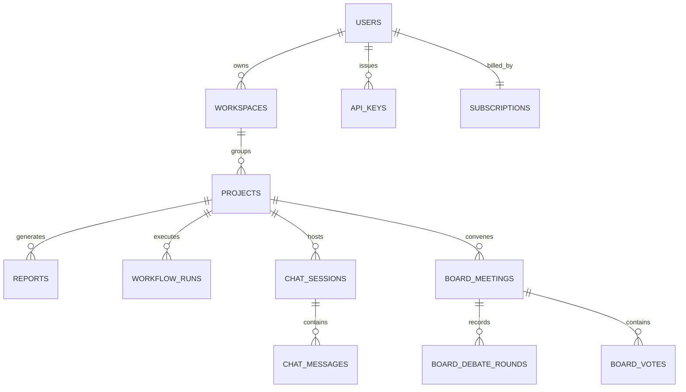

<div align="center">
  <h1>🚀 AI Startup Co-Founder SaaS Platform</h1>
  <p><em>An enterprise-grade, multi-agent validation engine to analyze, stress-test, and accelerate startup concepts.</em></p>
  
  [](https://nextjs.org/)
  [](https://fastapi.tiangolo.com/)
  [](https://python.langchain.com/docs/langgraph)
  [](https://www.postgresql.org/)
  [](https://qdrant.tech/)
</div>

---

## 🌟 Overview

Welcome to the **AI Startup Co-Founder** technical documentation. This platform acts as a virtual startup accelerator. Instead of spending weeks on market research, architecture design, and financial modeling, founders can submit their ideas to a cohort of **12 specialized AI Agents** orchestrated by a LangGraph pipeline.

You can use this guide to understand the system's architecture, database models, multi-agent workflows, RAG pipelines, and telemetry capabilities.

---

## ✨ Key Features & Latest Updates

- **🤖 12-Agent Validation Pipeline**: Coordinated execution of specialized nodes (Idea Analyzer, Market Research, MVP Planner, etc.) to generate pitch decks, financial models, architecture diagrams, GTM frameworks, and viability scores.
- **💀 Reality Validator (Startup Killer)**: A brutally honest skeptic-investor node that stress-tests critical assumptions, estimates customer acquisition costs (CAC), calculates failure probabilities, and outlines recommended pivots.
- **💬 AI Founder Copilot (Interactive Workspace)**: A RAG-enriched chat assistant allowing users to query startup databases, view semantic search citations, and receive real-time follow-up suggestions in a dedicated sub-workspace.
- **🧑‍⚖️ AI Board of Directors (Resolution Boardroom)**: A courtroom workspace where 11 virtual advisors (CEO, CTO, CFO, CPO, COO, CRO, etc.) debate and vote on strategic startup resolutions, computing a weighted consensus score and defining actionable next steps.
- **⏸️ Human-In-The-Loop (HITL) Checkpoints**: Deliberate pauses before key architecture and roadmap steps, enabling founders to approve draft data, correct directions, and inject custom directives.
- **🔍 RAG Vector-Search Pipeline**: Real-time context retrieval via Qdrant to enrich prompt templates with actual business frameworks, market reports, and reference designs.
- **📡 Telemetric Streaming Logs**: Real-time websocket logging that streams terminal updates of active agent nodes to the UI.

---

## 🏗 System Architecture

The project is structured as a decoupled containerized architecture deployed using Docker Compose.


### Infrastructure Layer Details
1. **FastAPI Backend**: Manages user authentication, project creation, API key scopes, and handles polling/WebSockets/SSE metrics.
2. **Next.js Frontend**: Responsive, modern tailwind-based dashboard that supports live run logs, interactive checkpoint approvals, copilot chat, boardroom debates, and PDF reports.
3. **Celery Worker**: Processes heavy LangGraph workflows asynchronously so API requests are not blocked. 
4. **Redis Cache/Broker**: Coordinates celery task queues and implements a Pub/Sub telemetry channel to stream log alerts and boardroom statements to clients.
5. **PostgreSQL**: Stores relational database models including workspaces, generated reports, chat history, and boardroom records.
6. **Qdrant Vector Store**: Handles high-performance semantic search over ingested frameworks and competitor matrices.
7. **Prometheus & Grafana**: Monitors system telemetry, API latency distribution, request counters, and memory leak warnings.

---

## 🧠 LangGraph Multi-Agent Workflow

The central execution pipeline is structured as a `StateGraph` in `backend/app/agents/graph.py`. It coordinates 12 agents in a sequential workflow, featuring Human-In-The-Loop (HITL) checkpoints.


### Agent Roles

| # | Agent Name | Primary Responsibility | Key Output Attributes |
|---|---|---|---|
| **1** | **Idea Analyzer** | Evaluates core concept and identifies base category. | `category`, `target_users`, `business_model` |
| **2** | **Market Research** | Estimates global market sizing metrics bottom-up. | `tam`, `sam`, `som`, `trends` |
| **3** | **Competitor Intel** | Identifies competing platforms and market pricing structures. | `competitors`, `opportunities` |
| **4** | **Reality Validator** | Stress-tests assumptions as a skeptic investor. | `viability_score`, `failure_probability`, `pivots` |
| **5** | **Technical Architect** | Details tech stack and monthly server bills. | `tech_stack`, `architecture`, `infra_costs` |
| **6** | **MVP Planner** | Defines development scope and weekly milestones. | `mvp_definition`, `core_features`, `roadmap_weeks` |
| **7** | **Financial Planner** | Computes Year 1 & 2 financial expectations. | `revenue_projection`, `break_even_months` |
| **8** | **Marketing Strategy** | Designs launch channels and GTM tactics. | `launch_strategy`, `growth_tactics` |
| **9** | **Risk Analysis** | Uncovers risk profiles and mitigations. | `market_risks`, `execution_risks`, `product_risks` |
| **10**| **Pitch Deck** | Outlines investment-ready slides. | `slides` |
| **11**| **Moderator** | Compiles section structures and trims token footprints. | `consolidated_markdown`, `resolved_conflicts` |
| **12**| **Evaluation** | Grades plan validation and hallucination counts. | `confidence_score`, `hallucination_check` |

### ⏸️ Human-In-The-Loop Checkpoints
When the Celery worker triggers the workflow, execution pauses at `technical_architect` and `mvp_planner`. The database status changes to `waiting_approval`. The frontend displays interactive text editors, enabling the user to:
1. Review and modify the recommended tech stack and monthly pricing.
2. Edit the prioritized backlog lists.
3. Add custom natural language guidance (feedback) which gets appended to the state, steering the subsequent agents.

---

## 🗄️ Database Schema

The database uses SQLAlchemy mapped columns to shape relational entities:


*(See `models.py` for full column definitions).*

---

## 🔍 RAG Retrieval & Vector Pipeline

The platform uses Retrieval-Augmented Generation (RAG) to inject validated business frameworks, pricing templates, and architecture designs into agent prompts:

1. **Ingestion & Isolation**:
   - Documents are processed using LangChain's `RecursiveCharacterTextSplitter`.
   - Chunks are embedded using `text-embedding-3-small` and saved into the Qdrant `cofounder_knowledge` collection.
   - **Tenant Isolation**: Reports are indexed with a `project_id`. Retrieve queries are filtered by project to prevent cross-tenant data leakage.
2. **Robust Fallback Layer**: 
   - A SHA-256 deterministic mock embedding fallback ensures developers without OpenAI keys can still run local semantic matching.
3. **Real-Time Retrieval**:
   - The top-scoring chunks are injected as a `RAG Context` block inside the agent's system prompt prior to generation.

---

## 💻 API Routing & Endpoints (v1)

FastAPI organizes controllers into multiple `v1` routers:

- **`/api/v1/auth`**: User registration, JWT bearer tokens.
- **`/api/v1/workspaces` & `/projects`**: Multi-tenant resource management and workflow execution triggers.
- **`/api/v1/copilot`**: Conversational session management and high-performance WebSockets (`/stream`) for real-time RAG answers and dynamic suggestions.
- **`/api/v1/board`**: Boardroom debate endpoints and Redis Pub/Sub powered debate streams.
- **`/api/v1/api-keys`**: Generates scoped, hashed API keys (`sk_cofounder_...`) for external API access.

---

## 🖥️ Frontend User Experience

The Next.js frontend uses modern, responsive client components:
- **Pipeline Progress Indicator**: A visual step-by-step timeline matching the LangGraph execution state.
- **Live Log Terminal**: Streams Celery progress logs in real-time via WebSockets.
- **Reality Check Visualizations**: Dial charts for failure probabilities and dynamic pivot cards.
- **AI Copilot Console**: Interactive chat with inline source citation cards and dashboard metrics.
- **AI Boardroom Dashboard**: Displays a circular verdict gauge alongside a grid of 11 animated advisor cards during live debates.
- **Clean PDF Printing**: The dynamic document visualizer is fully optimized for single-click `@media print` exports.

---

## 📈 Observability & Telemetry

Production monitoring is integrated natively:
- **Prometheus Exporter**: The `/metrics` route tracks ASGI request latency histograms, status codes, and active Celery queues.
- **Grafana Dashboard**: Visualizes API throughput and worker failures automatically.
- **Audit Logging**: Captures key administrative actions and execution payloads for robust security.

---

## 🛠️ Quick Setup & Local Launch

You can start the entire stack locally using Docker Compose.

### 1. Clone & Configure Environment
Create a `.env` file in the root directory and add your API keys:
```env
OPENAI_API_KEY=your-openai-api-key
GROK_API_KEY=your-grok-api-key
COHERE_API_KEY=your-cohere-api-key
AGENTOPS_API_KEY=your-agentops-api-key
LANGSMITH_API_KEY=your-langsmith-api-key
```

### 2. Start Services
```bash
docker-compose up --build
```
*(This starts PostgreSQL, Redis, Qdrant, FastAPI backend, Celery worker, Prometheus, and Grafana).*

### 3. Run Frontend Dev Server
In another terminal tab, navigate to the `frontend` folder and run:
```bash
cd frontend
npm install
npm run dev
```

### 4. Access Dashboards
- **Frontend Dashboard**: [http://localhost:3000](http://localhost:3000)
- **FastAPI Docs (Swagger)**: [http://localhost:8000/docs](http://localhost:8000/docs)
- **Grafana Metrics**: [http://localhost:3001](http://localhost:3001) *(Port mapped to 3001 to prevent conflicts)*
- **Prometheus Telemetry**: [http://localhost:9090](http://localhost:9090)

---
*Built to empower founders to focus on building, not just planning.*
